# Theta*: Any-Angle Path Planning on Grids

你可以在这里下载到原[论文](https://arxiv.org/ftp/arxiv/papers/1401/1401.3843.pdf)，并且在这里找到ros2中所实现的theta*[注释版本](https://github.com/hanlin-cheng/Basic_Theta_star_planner)

## 简介

在机器人和视频游戏中，具有被阻挡和未被阻挡两种单元格的网格通常被用于表示地形。然而，网格边形成的路径可能比实际地形中真正的最短路径长，因为它们的方向受到人为约束。

如图所示，A* 可以快速找到网格路径（即约束到网格边缘的路径），但网格路径通常不是真正的最短路径（即地形中的最短路线），因为它们的潜在航向被人为地约束为45度的倍数，这一缺点导致引入了所谓的任意角度路径规划。Basic Theta* 和Angle-Propagation Theta* 都是A* 的变体，它们沿着网格边缘传播信息（以实现短运行时间），而不限制到网格边缘的路径（以找到任何角度路径）。其中Basic Theta* 易于理解和实现，速度快，可找到短路径。值得注意的是，与可见性图上的A*不同，它们并不能保证找到真正的最短路径。

我们通过实验证明，Theta* 找到的路径比A* with post-smoothed paths和D* （我们所知的唯一一个沿着网格边缘传播信息而不将路径约束到网格边缘的A* 版本）更短，运行时间与网格上的A*相当。

## 现有路径规划算法

简单介绍一些现有的路径规划算法，**所有这些算法都是A*的变体**

### A*

你可以在这里找到A* 算法得原理介绍

A*算法通过下面这个函数来计算每个节点的优先级。
$$
f(n) = g(n) + h(n)
$$
其中：

- **f(n)** 是节点n的综合优先级。当我们选择下一个要遍历的节点时，我们总会选取综合优先级最高（值最小）的节点。
- **g(n)** 是节点n距离起点的代价。
- **h(n)** 是节点n距离终点的预计代价，这也就是A*算法的启发函数。关于启发函数我们在下面详细讲解。

A*算法在运算过程中，每次从优先队列中选取f(n)值最小（优先级最高）的节点作为下一个待遍历的节点。

下图是A*算法的伪代码

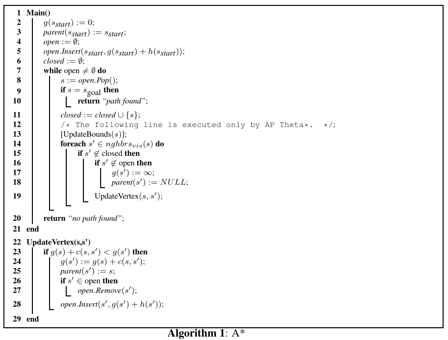

##### 注：路径提取（伪代码中未显示）遵循从目标顶点到起始顶点的父级，以反向检索从起始顶点到目标顶点的路径。

在网格顶点和边给出的图形上运行A* 。生成的路径被人为地约束为由网格的边缘形成，如图1（a）所示。因此，a* 在网格上找到的路径并不等同于真正的最短路径，而且看起来不现实，因为它们要么与真正的`最短路径`有很大的偏差，要么有更多的`航向变化`，这为平滑它们提供了动力。

### A* with Post-Smoothed Paths (A* PS)

A* PS在网格上运行A*，然后在后处理步骤中平滑生成的路径，这虽然会缩短路径长度但是会导致运行时间增加。常见的平滑算法如图所示

A* PS使用路径上的第一个顶点作为当前顶点。然后，它检查当前顶点s0是否具有到路径上其继任者的继任者s2的视线。如果是，A* PS会从路径中删除中间顶点s1，从而缩短其长度。A* PS然后通过再次检查当前顶点s0是否与路径上的后继顶点s3有视线等方式重复此过程。一旦当前顶点与路径上后继顶点的后继顶点没有视线，A* PS前进当前顶点并重复此过程，直到它到达路径的末端。

A* PS通常在网格上找到比A* 更短的路径，但不能保证找到真正的最短路径。下图显示了一个示例。A* PS不能保证找到真正的最短路径，因为它只考虑A* 搜索期间的网格路径，因此无法在A* 搜索过程中做出关于其他路径的明智决策。

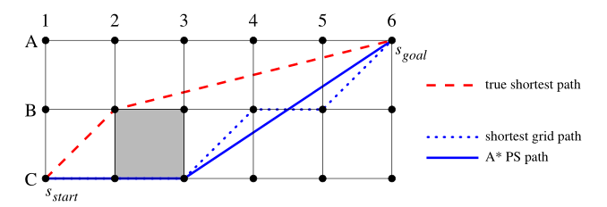

### Field D* (FD*)

FD* 沿着网格边缘传播信息，而不将路径限制到网格边缘。

当FD* 更新顶点s的未展开的可见邻居s′的g值和父级时，它考虑从起始顶点到顶点s′的周界上的任何点X（不一定是顶点）的所有路径。图4显示了一个示例。

FD* 不知道点X的g值，因为它只存储顶点的g值。它使用周长上与点X相邻的两个顶点的g值之间的线性插值来计算g值。即使顶点B3和C3的g值都等于它们的真实开始距离，计算的点X的g值也不同于其真实开始距离[＝2.55]。这个错误的原因很简单。存在从起始顶点通过顶点C3或顶点B3到目标顶点的真实最短路径。因此，线性插值假设预测还必须存在从起始顶点到沿着连接顶点B3和C3到目标顶点的边缘的任何点的短路径。然而，事实并非如此，因为路径需要绕过阻塞的格子B2-B3-C3-C2，这使得路径比预期的更长。由于错误计算了点X的g值，FD* 将顶点B4的父节点设置为点X，导致路径在点X处具有不必要的航向变化，甚至比最短的栅格路径更长。

FD* 的作者认识到，FD* 发现的路径经常有不必要的航向变化。有一些前瞻算法可以避免一些不必要的航向变化，如图4所示，但并不能消除所有这些变化。图5以红色显示了FD* 路径的示例，以蓝色显示了相应的真实最短路径。**FD* 路径仍有许多不必要的航向更改**。

### A* on Visibility Graphs

可见性图上的A* 可以找到真正的最短路径。如图所示。真正的最短路径只在被阻挡的单元格的角落有方向变化，而A* 在网格、A* PS和FD* 上找到的路径可能有不必要的方向变化。另一方面，可见性图上的A* **可能很慢**。它沿着可见性图边缘传播信息，其数量会随着单元格的数量呈二次方增长，而网格上的A* 、A* PS和FD* 沿着网格边缘传播信息耗时则要短一些。

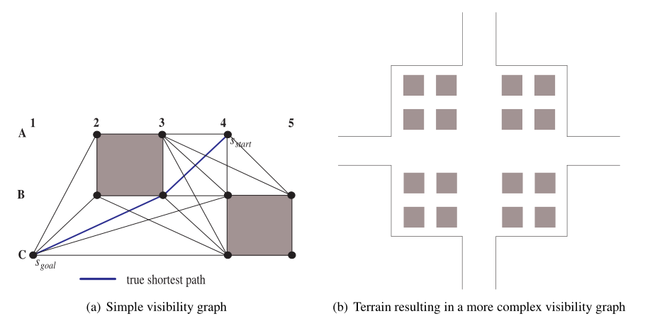

### 以上算法对比

我们简单描述了依据A* 算法的几种现有路径规划算法，下图描述了它们如何在两个冲突的标准（即运行时间和路径长度）之间进行权衡

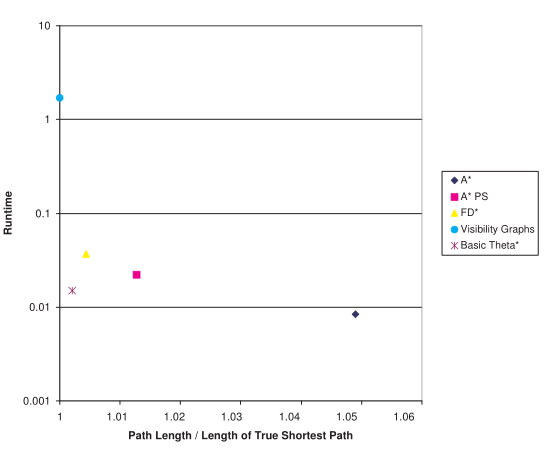

## Theta *

在本节中，我们将介绍Theta* ，它的路径只比真正的最短路径稍长，但只比网格上的A* 略慢。**Theta* 和A* 之间的关键区别在于，当使用Theta* 时，顶点的父对象可以是任何顶点，而当使用A* 时，该顶点的父节点必须是该顶点的邻居。**我们首先介绍Basic Theta* ，它是Theta* 的简单版本。

### Basic Theta*

算法3显示了Basic Theta* 的伪代码。过程Main与算法1中的A* 相同，因此未示出。

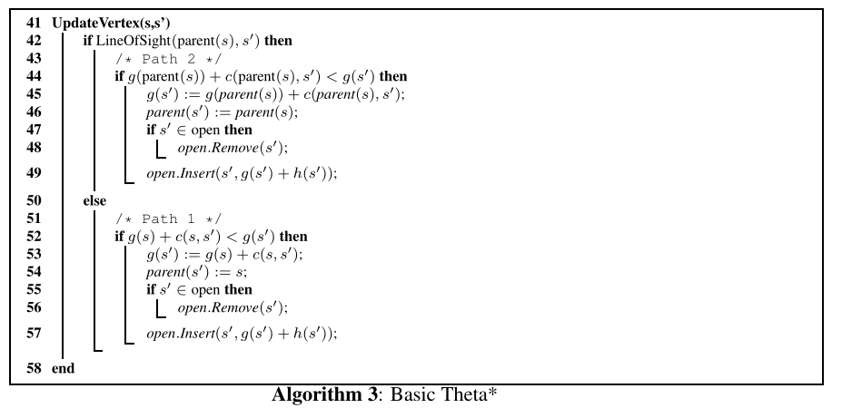

基本Theta* 很简单。它与A* 相同，不同之处在于，当它在过程Update Vertex中更新顶点s的未展开可见邻居s′的g值和父级时，它考虑两条路径而不是仅由A* 考虑的一条路径。

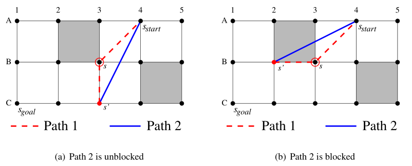

如图(a)显示了一个示例。基本Theta* 正在用父级A4扩展顶点B3，并且需要更新未扩展的可见邻居C3的g值和父级。基本Theta* 考虑两条路径：

**路径1**：基本Theta* 考虑从起始顶点到顶点s和从顶点s到顶点s′的直线路径，导致长度为g[Line52]。路径1是A* 考虑的路径。它对应于（a）中的红色虚线路径[A4，B3，C3]。

**路径2:** Basic Theta* 还考虑了从起始顶点到顶点s的父节点以及从顶点s的母节点到顶点s′的的路径，从而得到长度[Line 44]。A* 不考虑路径2，不允许Basic Theta*构造任何角度路径。它对应于图中的蓝色实线路径[A4，C3]。

#### 示例(Basic Theta*)

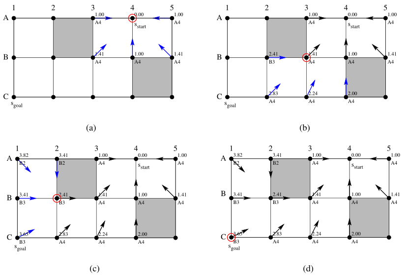

上图显示了Basic Theta* 的跟踪示例。每个顶点用其g值和父对象标记。箭头指向他们的父节点。红色圆圈表示正在展开的顶点，蓝色箭头表示在当前展开期间生成的顶点。

1. 首先，Basic Theta* 用父顶点A4展开起始顶点A4，如图（a）所示。它将顶点A4的未展开可见邻居的父对象设置为顶点A4，这和A* 所做的一样。
2. 其次，Basic Theta* 使用父节点A4展开顶点B3，如图（b）所示。顶点B2是顶点B3的未展开的可见邻居，不具有到顶点A4的视线。基本Theta* 因此根据路径1更新它，并将其父节点设置为顶点B3。另一方面，顶点C2、C3和C4是顶点B3的未展开可见邻居并且具有到顶点A4的视线的。因此，Basic Theta* 根据路径2更新它们，并将它们的父对象设置为顶点A4。（顶点B3的其他未展开的可见邻居的g值和父级不会更新。）
3. 第三，Basic Theta* 用父级B3展开顶点B2，如图（c）所示。坐标A1和A2是顶点B2的未展开的可见邻居，其不具有到顶点B3的视线。因此基本Theta* 根据路径1更新它们，并将它们的父对象设置为顶点B2。另一方面，顶点B1和C1是顶点B2的未展开的可见邻居，它们具有到顶点B3的视线。因此基本Theta* 根据路径2更新它们，并将它们的父对象设置为顶点B3。
4. 第四，Basic Theta* 用父节点B3扩展目标顶点C1并终止，如图（d）所示。然后，路径提取跟随从目标顶点C1到起始顶点A4的父节点，反向检索得到从起始顶点到目标顶点的真实最短路径[A4，B3，C1]。
5. 在每次迭代期间，它都会展开openlist列表中的一个顶点。在此过程中，它将从openlist中删除顶点，然后再也不能将其插入openlist中。由于顶点的数量是有限的，openlist最终会变为空，如果Basic Theta* 还没有提前终止，则必须终止。

#### Basic Theta* 的性质

这一部分定理都比较符合常识，并且不存在数学推理，因此不做过多论述，有兴趣的可以参考[原论文](https://arxiv.org/ftp/arxiv/papers/1401/1401.3843.pdf)

#### 对Basic Theta* 性能的一些总结与讨论

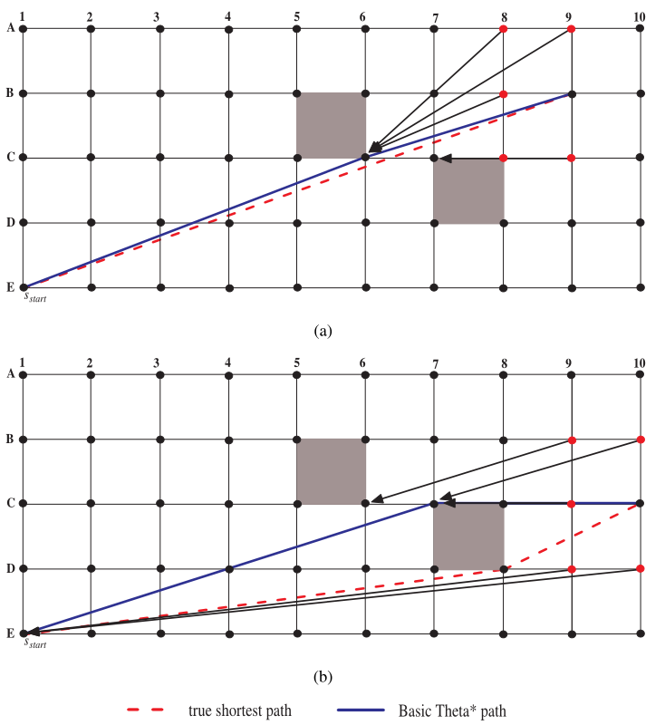

Basic Theta* 并不是最优的（也就是说，它不能保证找到真正的最短路径），因为**顶点的父对象必须是顶点的可见邻居或可见邻居的父对象**，而对于真正的最短路并不总是这样。图（a）显示了一个示例，其中红色虚线路径[E1，B9]是从起始顶点E1到顶点B9的真正最短路径，因为顶点E1具有到顶点B9的视线。然而，顶点E1既不是顶点B9的可见邻居，也不是其可见邻居的父对象，因为顶点E1对这些顶点没有视线（以红色突出显示）。因此，Basic Theta* 无法将顶点B9的父节点设置为顶点E1，并且无法找到从顶点E1到顶点B9之间的真正最短路径。类似地，图（b）显示了一个示例，其中红色虚线路径[E1，D8，C10]是从顶点E1到顶点C10的真实最短路径。然而，顶点D8既不是顶点C10的可见邻居，也不是其可见邻居的父节点，因为起始顶点E1要么对其具有视线，要么Basic Theta* 找到了从顶点E1到它们的路径，而这些路径并不包含顶点D8。事实上，从顶点E1到顶点C10的所有可见邻居（顶点E1没有视线在其上方（而不是下方）移动）的真正最短路径阻塞了单元格C7-C8-D8-D7。因此，Basic Theta* 无法将顶点C10的父节点设置为顶点D8，因此无法找到从顶点E1到顶点C10之间的真正最短路径。图（a）中从顶点E1到顶点B9的蓝色实线路径和图（b）中从点E1到顶点C10的蓝色虚线路径比实际最短路径长1.002倍。

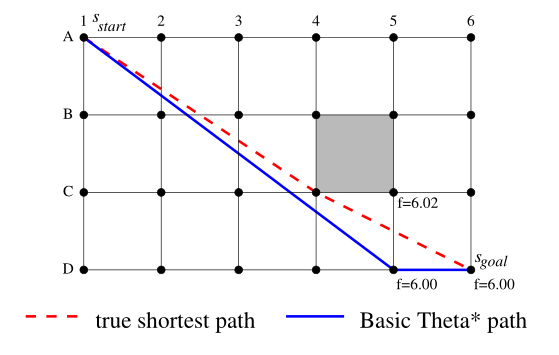

Basic Theta* 利用这样一个事实：**即真正的最短路径只在被阻挡的单元格的角落处有方向变化。然而，Basic Theta* 发现的路径有时会有不必要的航向变化。**上图显示了一个示例，其中Basic Theta* 找到从顶点A1到顶点D6的实心蓝色路径[A1，D5，D6]。这个错误的原因很简单。假设开放列表包含顶点C5和D5。顶点C5的f值为f（C5）=g（C5）+h（C5）=4.61+1.41=6.02，其父顶点为顶点C4。顶点D5的f值为f（D5）=5.00+1.00=6.00，其父顶点为顶点A1。因此，Basic Theta* 在顶点C5之前展开顶点D5（因为其f值较小）。当Basic Theta* 用父对象A1展开顶点D5时，它将生成顶点D6。顶点D6是顶点D5的未展开的可见邻居，其不具有到顶点A1的视线。因此，Basic Theta* 根据路径1对其进行更新，将其f值设置为f（D6）=6.00+0.00=6.00，将其父对象设置为顶点D5，并将其插入到打开列表中。因此，基本Theta*在顶点C5之前扩展目标顶点D6（因为其f值较小）并终止。

然后，路径提取跟随从目标顶点D6到起始顶点A1的父对象，以检索蓝色实心路径[A1，D5，D6]。因此我们发现，Basic Theta* 从不扩展顶点C5，扩展顶点C5才会导致它根据路径2将顶点D6的父级设置为顶点C4，路径提取才能检索红色虚线路径[A1，C4，D6]，这是真正的最短路径。图中从顶点A1到顶点D6的蓝色实线路径比实际最短路径长1.027倍。

### Angle-Propagation Theta* (AP Theta*)

AP Theta* 将Basic Theta* 每个顶点扩展的运行时间从线性减少到恒定。**AP Theta* 和Basic Theta* 之间的关键区别在于，AP Theta* 传播角度范围，并使用它们来确定两个顶点是否具有视线。**

如果顶点处有光源，光线无法通过被阻挡的单元格，则阴影中的单元格没有顶点的视线，而所有其他单元格都有顶点的视线。下图显示了一个示例，其中由两个角度边界θ1和θ2定义的红色角度范围内的所有点都具有到顶点的视线。AP Theta* 在顶点展开时计算顶点的角度范围，由于角度范围可以在恒定时间内传播，并且视线检查也可以在恒定的时间内执行。

算法4显示了AP Theta* 的伪码。过程Main与算法1中的A* 相同，因此未示出。将执行第13行。

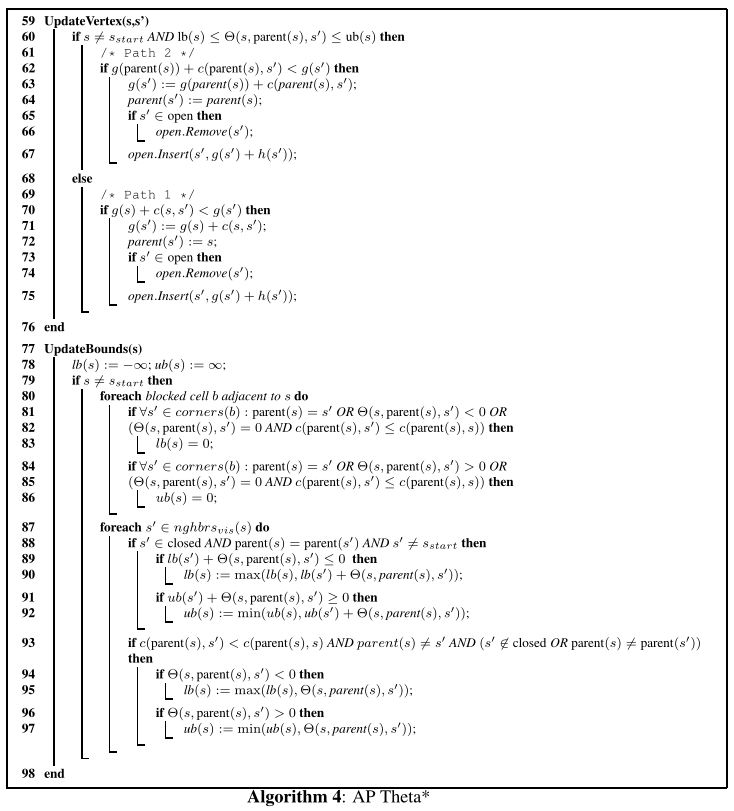

#### 角度范围的定义

我们现在讨论角度范围的关键概念。AP Theta* 为每个顶点s添加两个附加值，即顶点s的下角边界lb（s）和顶点s的上角边界ub（s），它们一起形成顶点s的角度范围[lb(s)，ub(s)]。角度边界对应于源自顶点s的父级的光线的方向（以度为单位）。从顶点s的父对象到顶点s的光线方向为零度。

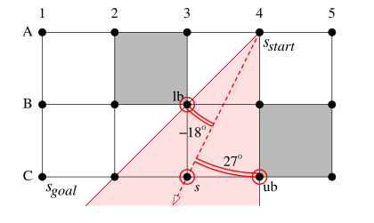

上图显示了一个示例，其中顶点C3与父顶点A4的角度范围为[-18，27]。因此，确保了红色区域中顶点C3的所有可见邻居具有到顶点C3的父对象的视线。例如，顶点C4具有到顶点C3的父对象的视线，但顶点B2没有。因此，AP Theta* 假设顶点B2与顶点C3的父对象没有视线。

Θ（s，p，s′）∈[−90，90]，是从顶点p到顶点s的光线与从顶点p到点s′的光线之间的角度（以度为单位）。如果从顶点p到顶点s的光线是从顶点p至顶点s′的光线的顺时针方向，则为正；如果从顶点p到顶点s的光线与从顶点p至顶点s′的光线具有相同的航向，则为零；如果从点p到点s的光线从顶点p至点s′的射线是逆时针方向，那么为负。

#### 角度范围更新

如上图算法UpdateBounds(s)所示，这里不做细节论述，感兴趣的可以参考[原论文](https://arxiv.org/ftp/arxiv/papers/1401/1401.3843.pdf)。

#### 对AP Theta* 性能的一些总结与讨论

AP Theta* 的操作方式与Basic Theta* 相同，因此具有与Basic Theta* 类似的属性。例如，AP Theta* 正确且完整。**它不能保证找到真正的最短路径，而且它的路径有时会有不必要的方向更改。**

AP Theta* 有时会对角度范围进行超出必要的限制，以确保其找到未阻塞的路径，这意味着其视线检查有时会失败，在这种情况下，它必须根据路径1而不是路径2更新顶点。AP Theta* 仍然是完整的，因为如果所有视线检查都失败，它会找到一条未阻塞的网格路径，**因为如果存在未阻塞的任何角度路径，则始终存在一条未堵塞的网格路径。**

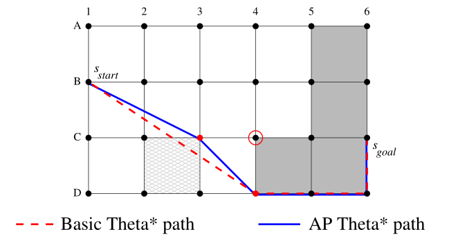

**AP Theta* 发现的路径可能比Basic Theta* 找到的路径更长。**上图显示了一个示例。当AP Theta* 用父顶点B1展开顶点C4并计算顶点C4的角度范围时，顶点C3未展开，因此不在闭合列表中。这意味着AP Theta* 没有足够的C3顶点信息。例如它不知道单元C2-C3-D3-D2是否畅通。AP Theta* 因此不能精确地确定顶点C4的角度范围，并且保守地假设顶点C3几乎没有到顶点B1的视线。然后，它使用得到的角度范围来确定顶点C4的未扩展的可见邻居D4不保证具有到顶点B1的视线。然而事实上，如果单元格C2-C3-D3-D2未被阻挡，则顶点D4与顶点B1是有视线的。AP Theta* 最终找到从起始顶点B1到顶点D4的蓝色实线路径[B1，C3，D4]，而Basic Theta* 找到的红色虚线路径[B1、D4]是真正的最短路径。

## 实验结果对比

在本节中，我们将Basic Theta* 和AP Theta* 与网格上的A* 、A* PS、FD* 和可见性图上的A* 的路径长度、顶点展开次数、运行时间（以秒为单位）和航向变化次数进行比较。

作者在100×100和500×500网格上比较了这些路径规划算法，这些网格具有不同百分比的随机阻挡单元和来自实时策略游戏Baldur's Gate II（游戏地图）的缩放地图。

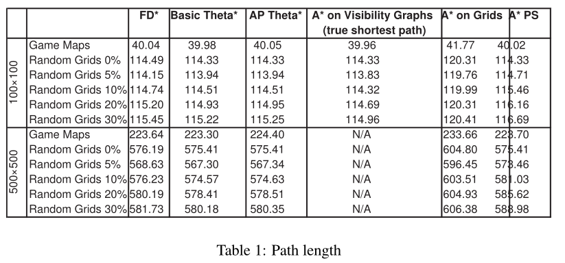

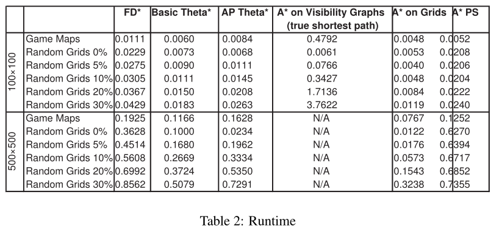

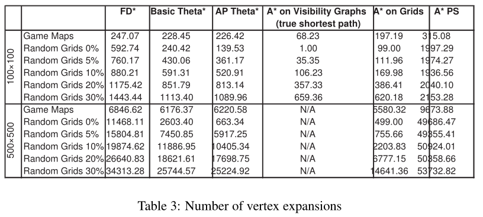

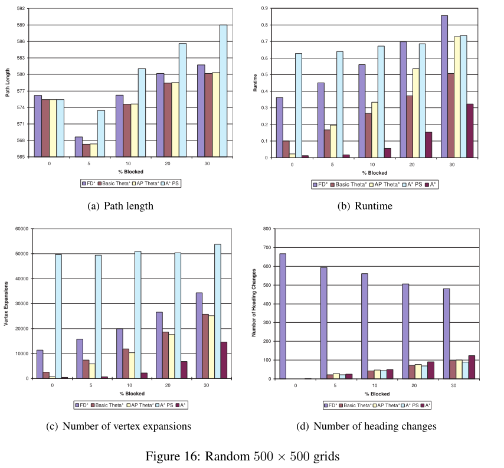

1.作者对路径长度进行了以下观察：

- 路径规划算法按路径长度增加的顺序排列为：可见性图上的A* （找到真正的最短路径），网格上的Basic Theta* 、AP Theta* ，FD* 、A* PS和A* 。在随机的500×500网格中，20%的单元格被阻挡，Basic Theta* 在70%的时间内发现比AP Theta* 更短的路径，97%的时间内找到比FD* 97%更短的路径。
- Basic Theta* 和AP Theta* 发现的路径几乎与真正的最短路径一样短，即使AP Theta* 有时限制角度范围超过了必要范围。例如，它们平均比100×100网格上的真实最短路径长1.003倍。
- Basic Theta* 比FD* 和A* PS更容易找到真正的最短路径。下图显示了一个示例，其中中心的浅绿色顶点是起始顶点，红色、绿色和蓝色顶点分别表示目标顶点，FD* 、A* PS和Basic Theta* 分别找到的路径。

2.作者对运行时进行了以下观察。按运行时间增加的顺序排列的路径规划算法是：网格上的A* 、Basic Theta* 、AP Theta* ，A* PS、FD* 和可见性图上的A* 。

3.作者对顶点展开的数量进行了以下观察。路径规划算法按顶点展开次数增加的顺序排列：可见性图上的A* ，网格上的A* ，AP Theta* ，Basic Theta* 、FD* 和A* PS。

4.最后，作者对航向变化的次数进行了以下观察。按航向变化次数增加的顺序排列的路径规划算法通常为：A* PS、A* （可见性图）、Basic Theta* 、AP Theta* 、A* 和FD* 。

上述趋势有一些例外。因此进行配对t检验。他们以置信水平α=0.01表明，**Basic Theta* 确实比AP Theta* 、A* PS和FD* 找到更短的路径，并且Basic Theta* 确实比AP Theta* 、A* PS和FD* 具有更短的运行时间。**

**总之，可见性图上的A* 可以找到真正的最短路径，但速度很慢。另一方面，网格上的A*可以找到很长的路径，但速度很快。任何角度的路径规划都介于这两个极端之间。**

因此，尽管作者也报告了一些AP Theta* 的实验结果，但在论文的剩余部分中，作者以Basic Theta* 为基础。然而，AP Theta* 将Basic Theta* 每个顶点扩展的运行时间从线性减少到常数。目前还不知道是否可以设计出使AP Theta* 比Basic Theta* 更快的恒定时间视线检查。这是未来研究的一个有趣领域，因为AP Theta*可能是通过更复杂的视线检查显著减少任何角度路径规划运行时间的第一步。

## Basic Theta* 的扩展

到目前为止，Basic Theta* 已经在网格上找到了路径，这些路径包含未阻塞的单元格，并且遍历成本相同。**在遍历成本相同这种情况下，真正的最短路径仅在被阻挡的单元格的角部具有方向变化，**并且三角形不等式成立，这意味着路径2不长于路径1。我们现在讨论Basic Theta* 的一个版本，该版本通过适当计算和比较路径长度（现在是路径成本）来查找包含未阻塞单元格且遍历成本不均匀的网格上的路径。

在这种情况下，真正的最短路径也可能在具有不同遍历成本的未阻塞单元格之间的边界处具有方向变化，并且三角形不等式不再保证成立，这意味着路径2可能比路径1更昂贵。因此，如果路径2未阻塞，Basic Theta* 不再无条件地选择路径2而不是选择路径1，而是选择成本较小的路径。它使用计算机图形学中的标准Cohen Sutherland裁剪算法来计算视线检查期间路径2的成本。如下图显示了从顶点C1到顶点A6的路径段C1-A6的示例。此直线在与单元边界相交的点处被分割为线段。路径段的成本是其每个线段的成本之和，**每个线段的成本是它的长度和相应未阻塞单元的遍历成本的乘积。**

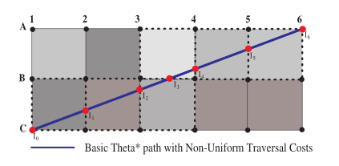

我们发现，将算法3中第52行的测试从“严格小于”改为“小于或等于”会略微减少Basic Theta* 的运行时间。这是由于计算路径1相对应的路径段的成本比计算路径2相对应的路径段的成本更快，因为路径1往往由更少的线段组成。

我们比较了和上的Basic Theta* 和网格上的A* 和FD* 的路径成本和运行时间（以秒为单位），因为A* 可以很容易地适应包含非均匀遍历成本的未阻塞单元的网格，而FD* 就是为这种情况而设计的。我们在1000×1000网格上比较了这些路径规划算法，其中每个单元被分配了1到15（对应于未阻塞单元）和无穷大（对应于阻塞单元）的整数遍历成本。

表（a）显示，如果以统一的概率选择每个遍历成本，则会产生统一遍历成本的小连续区域。FD* 的路径成本和运行时间都小于Basic Theta* 。A* 在网格上的路径成本仅比FD* 大1%左右，尽管其运行时间比FD* 小得多。因此，与网格上的a* 相比，任何角度规划都没有太大的优势。表（b）显示，如果以50%的概率选择遍历成本，并且以统一的概率选择所有其他遍历成本，则会产生具有统一遍历成本的大型连续区域。Basic Theta* 的路径成本现在小于FD* ，其运行时间与FD* 大致相同。FD* 发现的路径在具有相同遍历成本的区域中具有比Basic Theta* 更多的不必要的方向变化，这超过了Basic Theta* 发现的在具有不同遍历成本的两个单元格之间的边界上没有必要的方向改变的路径。A* 在网格上的路径成本比Basic Theta* 大3%以上。

**因此，任何角度规划现在都比网格上的A* 具有更大的优势**。

### 利用h值权衡运行时间和路径长度

A* 和Basic Theta* 共享一些可以在运行时间和路径长度之间进行权衡的策略。

需要注意的是，即使两种算法具有非常相似的伪代码，它们的行为也可能拥有非常大的不同。在本节中，我们扩展了Basic Theta* 的版本，这些版本可能能够在运行时间增加的同时找到更短的路径，**包括使用权重小于1的加权h值，打破开放列表中具有相同f值的顶点之间的联系支持具有较小g值的顶点（当它们决定下一个展开哪个顶点时），重新展开f值已降低的顶点**。

我们使用的所有路径规划算法具有一致h值。那么网格上的A* 具有以下属性：**在根据路径1更新任何未展开的可见相邻顶点之后，任何展开顶点的f值都不大于其未展开的相邻顶点的f，**这意味着在某个其他顶点之前展开的任何顶点的f都不大于该其他顶点的f值。因此，在搜索过程中的任何时间点，一旦展开了顶点，跟随从展开顶点到起始顶点的父对象，将反向检索从起始顶点到展开顶点的最短路径，**这意味着a* 无法通过多次展开顶点来找到较短路径。**

Basic Theta* 具有不同的属性：在根据路径2更新一个或多个未展开的可见相邻顶点之后，展开顶点的f值可以大于它们的f值，这意味着在某个其他顶点之前展开的顶点的f值可能会更大。因此，在搜索过程中的任何时间点，一旦顶点展开，从展开的顶点到起始顶点的父对象的跟随不能保证反向检索从起始顶点到顶点的最短路径，这意味着Basic Theta*可能会通过多次展开顶点找到更短的路径。

上图显示了一个示例。当Basic Theta* 用父顶点C1展开起始顶点C1时，它将生成顶点B2。顶点B2是顶点C1的未展开的可见邻居，其具有到顶点C1的视线。因此，Basic Theta* 根据路径2（在本例中与路径1相同）对其进行更新，将其f值设置为f（B2）=1.41+3.16=4.57，将其父对象设置为顶点C1并将其插入开放列表（图（a））。当Basic Theta* 稍后用父级C1展开顶点B2时，它将生成顶点B3。V顶点B3是顶点B2的未展开的可见邻居，其具有到顶点C1的视线。因此，Basic Theta* 根据路径2对其进行更新，将其f值设置为f（B3）=2.24+2.24=4.48，将其父级设置为顶点C1并将其插入打开列表（图（b））。因此，在根据路径2对其进行更新之后，扩展顶点B2的f值确实大于其未扩展可见邻居B3的f值，因为从顶点B2到顶点B3的g值的增加[＝0.83]小于从顶点B2至顶点B3的h值的减少[＝0.92]。当Basic Theta* 稍后展开顶点B3时，在顶点B3之前展开的顶点B2[=4.57]的f值确实大于顶点B3[=4.48]的f值。

这些属性表明，Basic Theta* 可能能够通过重新扩展顶点或扩展其他顶点（例如使用权重小于1的加权h值）在运行时间增加时找到更短的路径，而A* 则不能。同时，减少A* 运行时间的标准优化也可能会减少Basic Theta*的运行时间（例如，支持具有较大g值的顶点来打破开放列表中具有相同f值的顶点之间的联系）。

#### 启发函数加权h

具有一致h值的A* 可以找到相同长度的路径，无论h值有多小或多大。减小h值通常会增加A* 的顶点展开数。因此，我们现在讨论Basic Theta* 的一个版本，该版本通过使用权重小于1的加权h值，可以在运行时间增加时找到更短的路径。该版本的Basic Theta* 使用给定权重0 ≤ w < 1的h值，h（s）=w × c（s，sgoal）。图（a）显示了对顶点展开数和路径长度的影响示例。权重为1.00的Basic Theta* （目前使用）展开橙色顶点并找到红色路径。权重为0.75的Basic Theta* 展开蓝色顶点并找到蓝色路径。

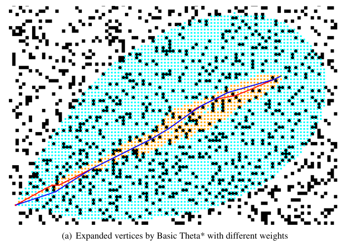

因此，Basic Theta*使用权重0.75比权重1.00时的路径短。

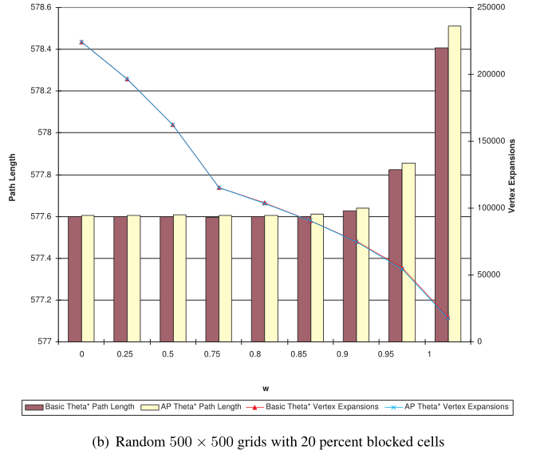

图（b）报告了不同权重对Basic Theta* 和AP Theta*在随机500×500网格上的路径长度和顶点扩展数的影响，其中20%的网格被阻挡。

（图表上Basic Theta* 和AP Theta* 的顶点展开次数几乎一致。）随着减小权重会减小路径长度，顶点展开次数和运行时间都会增加，。AP Theta* 的路径长度比Basic Theta* 减少得更多，因为AP Theta* 可以对角度范围进行更多的限制，从而从两个方面受益来扩展更多的顶点。**然而，Basic Theta* 和AP Theta* 都不能保证找到真正的最短路径，即使它们的权重为零。**

### Tie Breaking

作者讨论了Basic Theta* 的一个版本，该版本可以通过打破联系选择具有较小g值的顶点，在运行时间增加时找到更短的路径。下图的示例显示了对路径长度产生的影响。

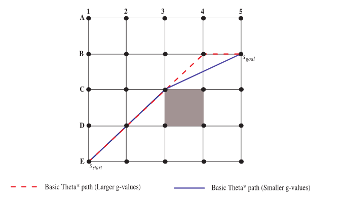

顶点C4和B4具有相同的f值，但顶点B4具有更大的g值，因为f（C4）= 3.83 + 1.41 = 5.24，f（B4）= 4.24 + 1 = 5.24。

如果Basic Theta* 趋向选择具有更大g值的顶点，那么它将在顶点C4与父顶点C3之间展开顶点B4，并最终将目标顶点与父顶点B4展开并终止。然后，路径提取跟随从目标顶点B5到起始顶点E1，以检索出红色虚线路径[E1，B4，B5]。然而，如果Basic Theta* 趋向选择具有较小g值的顶点，则它在扩展顶点B4之前扩展具有父级C3的顶点C4，并最终扩展具有父级C3视野的目标顶点并终止。然后，路径提取跟随从目标顶点B5到起始顶点E1，以检索出较短的蓝色实心路径[E1，C3，B5]。

上表报告了在具有20%阻挡单元的随机500×500网格上，打破连接方案对Basic Theta* 和AP Theta* 的路径长度、顶点扩展数和运行时间的影响。**选择具有较小g值的顶点既不会显著改变路径长度、顶点展开次数，也不会显著改变运行时间。**由于Basic Theta* 和AP Theta* 在网格上具有相同f值的顶点比A* 的顶点少，因此效果很小。

### 重新展开顶点

到目前为止，Basic Theta* 使用了一个封闭列表来确保它最多扩展一次每个顶点。具有一致h值的A* 不会重新展开顶点，无论它是否使用封闭列表，因为在展开顶点后，它无法找到从起始顶点到顶点的较短路径。另一方面，如果Basic Theta* 不使用封闭列表，它可以重新展开顶点，因为它可以在展开顶点后找到从起始顶点到顶点的较短路径。然后将顶点重新插入打开列表并最终重新展开他们。

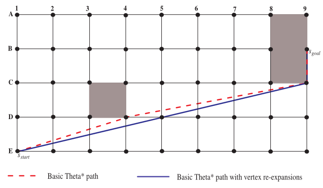

上图显示了顶点重新展开对路径长度的影响。没有顶点重新展开的Basic Theta* 最终用父节点D4展开顶点C8。顶点C9是顶点C8的未展开可见邻居，其具有到顶点D4的视线。因此，没有顶点重新展开的Basic Theta* 根据路径2更新它，并将其父对象设置为顶点D4。终止后，路径提取跟随从目标顶点B9到起始顶点E1，以检索红色虚线路径[E1，D4，C9，B9]。然而，顶点重新展开的Basic Theta* 最终用父节点D4展开顶点C8，然后用父E1重新展开顶点C8。节点C9是顶点C8的可见邻居，其具有到顶点E1的视线。具有顶点重新展开的Basic Theta* 因此根据路径2更新它，并将其父对象设置为顶点E1。终止后，路径提取跟随从目标顶点B9到起始顶点E1，以检索较短的蓝色实心路径[E1，C9，B9]。

## 总结

可见性图上的A* 可以找到真正的最短路径，但速度较慢。另一方面，网格上的A* 可以找到很长的路径，但速度很快。任何角度路径规划算法都介于这两个极端之间。在运行时间和路径长度之间的权衡方面，Basic Theta* 与AP Theta* 、A* PS和FD* 相比占据优势。

## 附录A Line-of-Sight

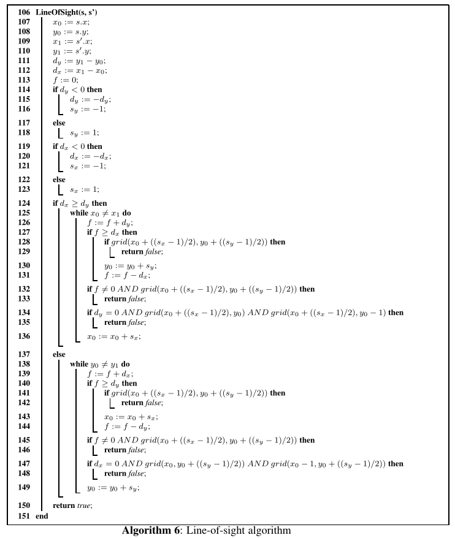